# Garbage-management-system
<h2>Location based garbage management system | PHP/ HTML/ CSS /JS </h2>

With the development of technology, people have become more selfish and careless. As a result, heaps of garbage can be seen almost anywhere. It is very uncomfortable to pass those areas where garbage is collected due to the terrible smell and unpleasant sight. 

To overcome the shortcomings of notifying the garbage collected locations we have developed a web-based application. This application uses google maps embedded to it which displays the locations where garbage is collected.

The solution we have developed has five types of users who have different roles to perform in the application.

		<ul>
		  <li>Volunteers</li>
		  <li>General Public</li>
		  <li>Administrator</li>
		  <li>Captain	</li>
		  <li>Collection Staff</li>
		</ul>
	

Volunteers are considered as Green Task Force (GTF). They have the authority to insert garbage collected spots on the map by setting a pin, at the same time they can send a message stating the reason along with an image. Volunteers can get registered with the application for free. 

CMC has employed a person who is referred to as ‘Captain’ has the authority to view all reported instances, view messages posted by the volunteers. Then they can set the priority level of the cleaning process and update the record.

Collection Staff can also view the locations set by the volunteers. But the icon displayed on the map will be changed according to the priority set by the captain.

There is an administrator who only has powers to register ‘Collection Staff’ and ‘Captain’ with the application. He/she also has the authority to add locations of garbage dump places on a map that is visible to the general public.

The general public are the typical viewers of the web site who can surf the details of CMC. They are not required to get register with the application to do so.
 

<h3>Challenges faced</h3>

<ul>
<li>We had to face a lot of difficulties when developing this web application.</li>
<li>This development is the first google API experience for us. Therefore, we had to find a lot of details about google APIs.</li>
<li>Another problem that we have faced is, how to create an info window with image insertion capabilities. After referring to lots of articles and video tutorials we found the solution for inserting the elements.</li>
<li>Still we could not find any method, article, or video tutorial to understand how to retrieve inserted elements from the database into the info window of Google Maps.</li> 
<li>Therefore, we have decided to implement some locations of garbage dumps along with images coded manually.</li>
</ul>

<h3>Conclusion</h3>

As a summary, we have developed a fully working and interactive web site to meet the requirements of the Colombo Municipal Council. But still, there are some modifications and developments that need to be performed, then only this application will become a fully functioning application. However, as a group, we think that the developed application will help the staff of CMC to keep the environment clean and go green.

<h3>Screen Shots</h3>

Home page

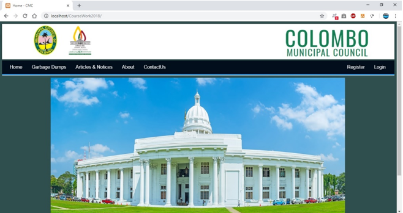

This page will display garbage dumped locations to the general public with image

	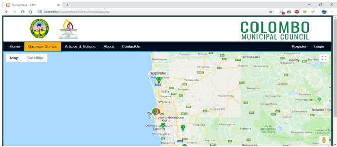

This page will display special articles and notices to the general public

	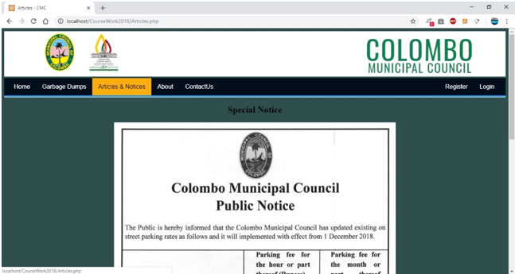

General public can view vision, mission and history of CMC in this page

	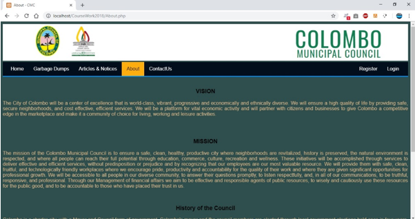

Contact details of the Colombo Municipal  Council is displayed here

	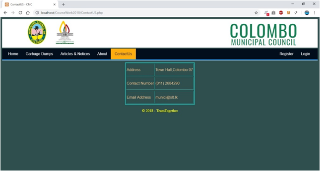

This is the user registration form

	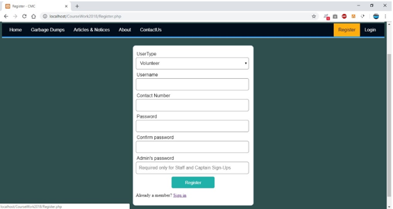

This button will take the users to login page which has three roles.
	
	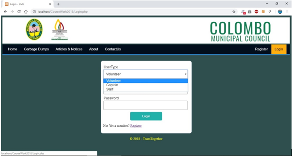

This page contains  Captains Map who can set the priority of cleaning.

	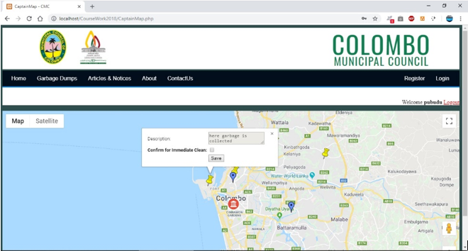

This map is the Staff Map which display the markers in  two colors according to priority set for cleaning by the Captain. 

	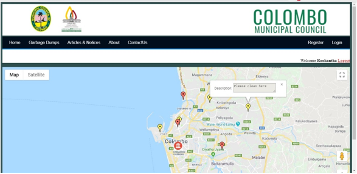

This is the volunteer map who can add locations along with image and description

	
	
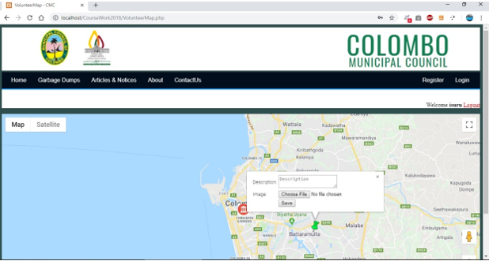

	
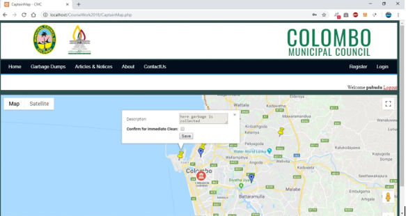

	
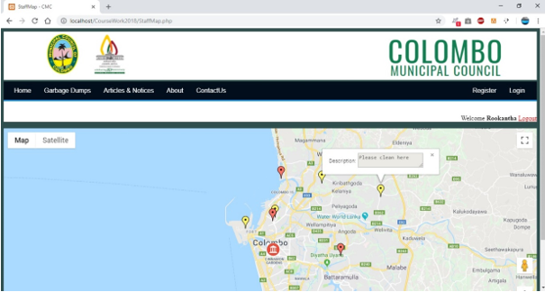

	
	
	
	
	
	
	
	
	
	
	
	
	
	
	
	
	
	
	
	
	
